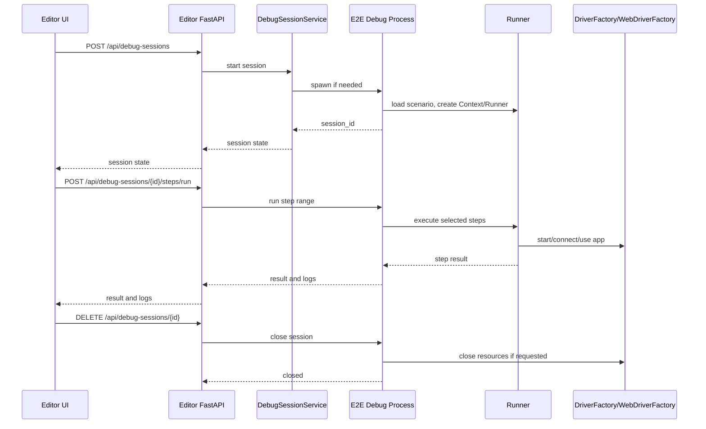

# デバッグセッション実行機能 改修設計

## 1. 目的

現在の実行機能は、エディタから `pytest tests/test_runner.py` を別プロセスで起動する方式である。
この方式では「ここまで」と「選択のみ」がそれぞれ独立した pytest 実行になるため、前回実行で作られた `DriverFactory._app`、`WebDriverFactory._driver`、`Context` の変数、画面状態は次回実行へ引き継がれない。

本設計では、エディタから開始したデバッグ中だけ常駐する E2EFramework 側のデバッグプロセスを作り、同じ Python プロセス内でステップを順次実行できるようにする。
これにより、「ここまで」で起動したアプリやブラウザを閉じずに、その後の「選択のみ」「次へ」を同じ状態で実行できるようにする。

## 2. 対象範囲

対象は以下の 2 リポジトリである。

- `D:/Script/E2ETestScenarioEditor`
- `D:/Script/E2EFramework`

エディタ側はデバッグセッションの開始、ステップ実行指示、状態表示、終了を担当する。
E2EFramework 側は常駐デバッグプロセス、シナリオロード、`Runner` によるステップ実行、リソース保持と破棄を担当する。

通常の pytest 実行は維持する。
デバッグセッションは、pytest レポートを主目的とする通し実行ではなく、開発中のシナリオ確認を主目的とする別の実行モードとして追加する。

## 3. 現状の問題

### 3.1 プロセス境界で状態が消える

現在の `ExecutionService` は実行ごとに `subprocess.Popen` で pytest を起動する。
pytest が終了すると、そのプロセス内にあった以下の状態は消える。

- `DriverFactory._app`
- `WebDriverFactory._driver`
- `Context` の変数
- `Runner` / `ActionDispatcher` のインスタンス
- ページオブジェクトが参照するアプリ接続

さらに `tests/conftest.py` の session teardown で `DriverFactory.close_app()` と `WebDriverFactory.close_browser()` が呼ばれるため、プロセス終了時に対象アプリも閉じる設計になっている。

### 3.2 「選択のみ」は前提ステップを含まない

「選択のみ」は選択ステップの範囲だけを実行する。
たとえばメモ帳サンプルで「テキストを入力」だけを実行すると、直前の「メモ帳を起動」が実行されない。
そのため `BasePage.__init__()` から `DriverFactory.get_app()` を呼んだ時点で `Application not started` になる。

### 3.3 pytest は対話的ステップ実行に向いていない

pytest は 1 回のテスト実行とレポート生成には向いているが、同じテストプロセスを保持したままエディタから任意ステップを追加実行する用途には向いていない。
本当のデバッグセッションには、pytest ではなく E2EFramework の `Runner` を直接操作する常駐実行サービスが必要である。

## 4. 基本方針

### 4.1 通常実行とデバッグ実行を分ける

既存の pytest 実行は以下の用途として残す。

- 通し実行
- CI や回帰確認に近い実行
- pytest-html レポート生成
- セッション終了時の確実な cleanup

新規のデバッグセッションは以下の用途に限定する。

- 「ここまで」で前提状態を作る
- 同じ状態のまま「選択のみ」を実行する
- 「次へ」で 1 ステップずつ進める
- 失敗後に画面状態を残して調査する

### 4.2 デバッグプロセスを常駐させる

エディタの FastAPI プロセス内で E2EFramework を import して直接動かすのではなく、E2EFramework ルートを `cwd` とする専用 Python プロセスを起動する。
このプロセスは軽量な HTTP サーバ、または stdin/stdout JSON-RPC サーバとして常駐する。

推奨は HTTP サーバである。
理由は以下。

- エディタの FastAPI から通常の HTTP クライアントで呼べる
- セッション状態、ログ、キャンセル、ヘルスチェックを API として表現しやすい
- 将来、エディタ以外のツールからも利用しやすい

### 4.3 セッション単位で Runner と Context を保持する

デバッグプロセス内に `DebugSession` を作り、以下を保持する。

- `session_id`
- `scenario`
- `Context`
- `Runner`
- 現在のステップ位置
- 実行済みステップ履歴
- 失敗情報
- ログバッファ
- cleanup 方針

`DriverFactory` と `WebDriverFactory` は現状クラス変数で単一状態を持つため、Phase 1 では同時デバッグセッション数を 1 に制限する。
複数セッション対応は DriverFactory の alias 化、またはセッション別プロセス分離が必要になるため後続対応とする。

## 5. 目標 UX

### 5.1 操作

エディタに以下のデバッグ操作を追加する。

- `デバッグ開始`: シナリオをロードし、デバッグセッションを作る
- `ここまで`: 同じセッション内で先頭から選択ステップまで実行する
- `選択のみ`: 同じセッション内で選択ステップだけを実行する
- `次へ`: 現在位置の次ステップを 1 つ実行する
- `停止`: 実行中ステップのキャンセルを試みる
- `デバッグ終了`: teardown と close を実行し、セッションを破棄する
- `強制終了`: デバッグプロセスごと停止する

### 5.2 期待する動き

メモ帳サンプルでは以下の流れを成立させる。

1. 「メモ帳を起動」を選んで「ここまで」
2. メモ帳が起動したままセッションが残る
3. 「テキストを入力」を選んで「選択のみ」
4. 同じ `DriverFactory._app` を使って入力が成功する
5. 「スクリーンショットを取得」を選んで「選択のみ」
6. 同じメモ帳画面に対してスクリーンショットが取得される

## 6. アーキテクチャ



## 7. E2EFramework 側の改修

### 7.1 新規モジュール

以下を追加する。

- `src/core/debug/debug_session.py`
- `src/core/debug/debug_server.py`
- `src/core/debug/models.py`
- `src/core/debug/log_buffer.py`
- `scripts/debug_server.py`

`scripts/debug_server.py` はデバッグプロセスの起動入口にする。

例:

```powershell
python scripts/debug_server.py --host 127.0.0.1 --port 0 --env DEFAULT
```

`--port 0` の場合は空きポートを OS に選ばせ、起動後に標準出力へ JSON でポート番号を出す。

### 7.2 DebugSession

`DebugSession` は pytest から独立して `Runner` を操作する。

想定インターフェース:

```python
class DebugSession:
    def __init__(self, scenario, env: str, run_id: str):
        self.session_id = ...
        self.scenario = scenario
        self.context = Context()
        self.runner = Runner(self.context)
        self.current_section = "steps"
        self.current_index = -1
        self.history = []

    def run_until(self, section: str, step_end: int) -> dict:
        ...

    def run_range(self, section: str, step_start: int, step_end: int) -> dict:
        ...

    def run_single(self, section: str, step_index: int) -> dict:
        ...

    def run_next(self) -> dict:
        ...

    def close(self, run_teardown: bool = True, close_resources: bool = True) -> dict:
        ...
```

### 7.3 Runner の分割

現状の `Runner.execute_scenario()` はシナリオ単位でループする。
デバッグ実行では 1 ステップ単位の結果が必要なため、内部処理を分割する。

追加候補:

```python
class Runner:
    def execute_step(self, step: dict, index: int = None, section: str = "steps") -> dict:
        ...

    def execute_steps(self, scenario: dict, section: str, start: int, end: int) -> list[dict]:
        ...
```

既存の `execute_scenario()` は `execute_steps()` を呼ぶ形に寄せる。
これにより pytest 実行とデバッグ実行でステップ実行ロジックを共有できる。

ステップ結果は以下の形を返す。

```json
{
  "section": "steps",
  "index": 1,
  "name": "テキストを入力",
  "status": "passed",
  "started_at": "2026-05-18T13:00:00+09:00",
  "ended_at": "2026-05-18T13:00:01+09:00",
  "error": null
}
```

### 7.4 ScenarioLoader の利用

デバッグセッション開始時は `ScenarioLoader.load_scenarios(file_path=..., scenario_id=...)` を利用する。
ステップ範囲の切り出しは loader では行わず、完全なシナリオを保持した上で `DebugSession` 側が範囲実行する。

理由:

- 「ここまで」の後に別のステップを実行するため、完全なステップ配列が必要
- 現在位置や履歴を session 内で管理しやすい
- 共有シナリオ展開後の実行対象とログを一貫させやすい

### 7.5 Context 初期化

pytest の `setup_session` 相当の初期化を、デバッグセッションでも使えるよう関数化する。

追加候補:

```python
def initialize_execution_context(env: str, run_folder: str) -> Context:
    context = Context()
    context.load_config("config/config.ini", env)
    context.set_variable("SCREENSHOTDIR", screenshot_dir)
    return context
```

pytest fixture と debug server の両方からこの関数を呼ぶ。
これにより通常実行とデバッグ実行で config / screenshot dir の差異を減らす。

### 7.6 リソース終了

デバッグセッション終了時だけ `DriverFactory.close_app()` と `WebDriverFactory.close_browser()` を呼ぶ。
各ステップ実行の後には close しない。

終了 API では以下を選べるようにする。

- `run_teardown`: シナリオの `teardown` セクションを実行するか
- `close_resources`: アプリやブラウザを閉じるか
- `force`: デバッグプロセスごと終了するか

失敗時はデフォルトでリソースを残す。
調査後にユーザーが「デバッグ終了」または「強制終了」を押して閉じる。

### 7.7 キャンセル

Python スレッド内で実行中の pywinauto / Selenium 操作を安全に即時停止することは難しい。
Phase 1 のキャンセルは以下に限定する。

- 実行中フラグを `cancelling` にする
- 現在のアクションが戻った後、次ステップへ進まない
- UI には「現在の操作が戻るまで待機」と表示する

即時停止が必要な場合はデバッグプロセスを強制終了する。

## 8. Editor 側の改修

### 8.1 新規バックエンドサービス

`src/backend/debug_session_service.py` を追加する。

責務:

- E2EFramework の debug server プロセス起動
- 起動ポートの検出
- デバッグ API へのプロキシ
- セッション状態の保持
- ログ取得
- プロセス強制終了

既存の `ExecutionService` は pytest 実行専用として維持する。

### 8.2 新規 API

Editor FastAPI に以下を追加する。

- `POST /api/debug-sessions`
- `GET /api/debug-sessions/{session_id}`
- `GET /api/debug-sessions/{session_id}/logs`
- `POST /api/debug-sessions/{session_id}/run`
- `POST /api/debug-sessions/{session_id}/next`
- `POST /api/debug-sessions/{session_id}/cancel`
- `DELETE /api/debug-sessions/{session_id}`
- `POST /api/debug-sessions/{session_id}/force-kill`

開始リクエスト:

```json
{
  "scenario_path": "D:/Script/E2EFramework/scenarios/sample/SAMPLE-001_notepad.json",
  "scenario_id": "SAMPLE-001",
  "env": "DEFAULT"
}
```

ステップ実行リクエスト:

```json
{
  "mode": "single",
  "section": "steps",
  "step_start": 1,
  "step_end": 1
}
```

レスポンス:

```json
{
  "session_id": "dbg_20260518_230000_ab12cd34",
  "status": "idle",
  "scenario_path": "...",
  "scenario_id": "SAMPLE-001",
  "current_section": "steps",
  "current_index": 1,
  "last_result": {
    "status": "passed",
    "steps": []
  }
}
```

### 8.3 フロントエンド UI

既存の実行ボタンとは別に、デバッグ操作を追加する。

最小構成:

- `Debug Start`
- `Run Until`
- `Run Selected`
- `Step Next`
- `Debug End`
- `Force Kill`

日本語表示案:

- `デバッグ開始`
- `ここまで`
- `選択のみ`
- `次へ`
- `終了`
- `強制終了`

通常実行の「ここまで」「選択のみ」と混同しないよう、デバッグセッション中はボタンの見た目とパネル表示を明確に分ける。

### 8.4 状態表示

実行パネルには以下を表示する。

- セッション状態: `not_started` / `starting` / `idle` / `running` / `failed` / `closing` / `closed`
- 現在位置: `steps[1] テキストを入力`
- 実行済みステップ履歴
- 最後のエラー
- ログ
- リソース状態: app/browser が起動中か

ステップ一覧では以下を表示する。

- 実行済み: 成功 / 失敗アイコン
- 現在位置: 強調表示
- 次に実行されるステップ: 薄い強調

## 9. API 詳細

### 9.1 E2E Debug Process API

デバッグプロセスは Editor からのみアクセスするため、`127.0.0.1` bind とする。

| Method | Path | 用途 |
| --- | --- | --- |
| `GET` | `/health` | 起動確認 |
| `POST` | `/sessions` | セッション作成 |
| `GET` | `/sessions/{id}` | 状態取得 |
| `GET` | `/sessions/{id}/logs` | ログ取得 |
| `POST` | `/sessions/{id}/run` | 範囲実行 |
| `POST` | `/sessions/{id}/next` | 次ステップ実行 |
| `POST` | `/sessions/{id}/cancel` | キャンセル要求 |
| `DELETE` | `/sessions/{id}` | teardown / close |
| `POST` | `/shutdown` | プロセス終了 |

### 9.2 実行モード

`/sessions/{id}/run` の `mode` は以下。

- `until`: 指定 section の 0 から `step_end` まで実行
- `single`: `step_start` の 1 ステップだけ実行
- `range`: `step_start` から `step_end` まで実行
- `teardown`: teardown セクションを実行

`until` は既に実行済みのステップを再実行するかどうかを制御できるようにする。

```json
{
  "mode": "until",
  "section": "steps",
  "step_end": 3,
  "rerun_executed": false
}
```

`rerun_executed=false` の場合、現在位置が `steps[1]` なら `steps[2]` から `steps[3]` だけ実行する。
ただし「最初から作り直したい」場合はセッションを作り直す。

## 10. 実行ルール

### 10.1 既に実行済みのステップ

デフォルトでは、同一セッション内の「ここまで」は実行済みステップを再実行しない。
理由は、`start_app` や入力処理を再実行すると画面状態が壊れやすいためである。

再実行したい場合は `デバッグ再開始` または `rerun_executed=true` を使う。

### 10.2 選択のみ

デバッグセッション中の「選択のみ」は、現在のアプリ状態と `Context` を使って対象ステップだけを実行する。
前提が足りない場合は通常通り失敗させる。

UI では、デバッグセッション未開始の状態で「選択のみ」を押した場合は以下の選択肢を出す。

- デバッグ開始してから実行
- 通常の単独実行として実行
- キャンセル

Phase 1 では確認ダイアログを省略し、デバッグ操作ボタンはセッション開始後だけ有効化してもよい。

### 10.3 失敗時

ステップ失敗時はセッションを破棄しない。
状態は `failed` にし、次の操作を選べるようにする。

- 同じステップを再実行
- 別のステップを選択して実行
- スクリーンショット取得
- デバッグ終了
- 強制終了

### 10.4 teardown

デバッグ中は各ステップ後に teardown を実行しない。
`デバッグ終了` 時に `run_teardown=true` の場合だけ実行する。

teardown 失敗時も、リソース close は可能な範囲で実行する。
teardown エラーと close エラーは両方ログに残す。

## 11. ログと成果物

pytest-html と同じレポート生成は Phase 1 では対象外にする。
代わりに、デバッグセッション用の成果物ディレクトリを作る。

例:

```text
reports/debug_dbg_20260518_230000_ab12cd34/
  debug.log
  screenshots/
  session.json
```

`session.json` には以下を保存する。

- session id
- scenario path
- scenario id
- env
- started_at / ended_at
- step results
- last error
- close policy

将来、デバッグセッション結果から簡易 HTML レポートを作ることは可能だが、pytest-html と同じ意味のテストレポートとは分ける。

## 12. セキュリティと安全性

- debug server は `127.0.0.1` のみに bind する
- エディタは framework path を検証済みの E2EFramework ルートに限定する
- scenario path は既存の許可ディレクトリ配下に限定する
- 任意コマンド実行 API は作らない
- debug server の起動コマンドは固定する
- 強制終了時は起動した debug server プロセスだけを対象にする
- Phase 1 では同時セッション 1 件に制限する

## 13. 実装フェーズ

### Phase 1: 最小デバッグセッション

目的は、メモ帳サンプルで「ここまで」後に「選択のみ」が成功すること。

E2EFramework:

- `Runner.execute_step()` / `execute_steps()` を追加
- pytest fixture から独立した context 初期化関数を追加
- `DebugSession` を追加
- `debug_server.py` を追加
- session close で `DriverFactory.close_app()` / `WebDriverFactory.close_browser()` を呼ぶ

Editor:

- `DebugSessionService` を追加
- debug server プロセス起動と終了を実装
- debug session API を追加
- フロントエンドに `デバッグ開始` / `選択のみ` / `終了` を追加

受け入れ条件:

- `デバッグ開始` でセッションが作成される
- 「メモ帳を起動」まで実行後、メモ帳が閉じない
- 「テキストを入力」の「選択のみ」が同じセッション内で成功する
- `デバッグ終了` でメモ帳が閉じる
- 既存の pytest 通常実行が壊れない

### Phase 2: ステップ実行 UX

- `次へ` を追加
- 現在位置と実行済み状態をステップ一覧に表示
- 失敗ステップを UI 上で強調
- ログポーリングを実装
- `rerun_executed` の制御を追加

### Phase 3: teardown / cleanup 強化

- `run_teardown` の UI オプションを追加
- 失敗時にリソースを残す / 閉じるを選べるようにする
- 強制終了後の残プロセス検出を追加
- アプリ接続状態のヘルスチェックを追加

### Phase 4: 複数アプリ / 複数セッション対応

- `DriverFactory` の alias 化
- `BasePage` の app alias 対応
- `SystemAction.connect_app` の追加
- セッション別 debug process またはセッション別 DriverFactory 状態の導入

## 14. 既存設計への影響

### 14.1 ExecutionService

既存の `ExecutionService` は変更を最小にする。
pytest 実行の責務を維持し、デバッグ実行は `DebugSessionService` に分離する。

### 14.2 ScenarioLoader

既存のステップ範囲切り出しは通常実行用として残す。
デバッグ実行では完全なシナリオをロードし、範囲制御は `DebugSession` が行う。

### 14.3 Runner

`Runner` はシナリオ単位だけでなくステップ単位実行を公開する。
既存の `execute_scenario()` は後方互換を維持する。

### 14.4 pytest hooks

pytest hooks は通常実行専用として維持する。
デバッグ実行では pytest hooks に依存せず、debug server 側でログ、スクリーンショット、session metadata を生成する。

## 15. テスト計画

### 15.1 E2EFramework 単体

- `Runner.execute_step()` が 1 ステップだけ実行する
- `Runner.execute_steps()` が指定範囲だけ実行する
- ignored step が skip される
- condition false の step が skip される
- 例外時に step result が failed になる

### 15.2 DebugSession

- セッション開始時に Context と Runner が作られる
- `run_until` 後に現在位置が更新される
- `run_single` が同じ Context / DriverFactory を使う
- 失敗後もセッションが残る
- close 時に teardown と close resources が実行される

### 15.3 Editor backend

- debug server を起動できる
- 起動失敗時に明確なエラーを返す
- session API が debug server へ正しくプロキシされる
- force kill で対象プロセスだけを終了する
- 通常実行中はデバッグ開始を拒否する、または逆も拒否する

### 15.4 結合

- メモ帳サンプルで「ここまで」後に「選択のみ」が成功する
- Web ブラウザ起動シナリオで同じ WebDriver を使って次ステップを実行できる
- 失敗時に画面状態が残る
- デバッグ終了でリソースが閉じる
- 既存の通し実行が従来通り pytest レポートを生成する

## 16. リスク

### 16.1 長時間常駐による残プロセス

デバッグプロセスや対象アプリが残る可能性がある。
Editor 側に強制終了を用意し、起動した debug server の PID を必ず保持する。

### 16.2 アクションの即時キャンセル困難

pywinauto や Selenium の呼び出し中は Python 側から安全に割り込めない場合がある。
Phase 1 では強制終了を最終手段とし、通常キャンセルは次ステップ抑止として扱う。

### 16.3 pytest レポートとの差異

デバッグ実行は pytest の test result ではない。
UI では「デバッグ結果」と「テスト実行結果」を明確に分ける。

### 16.4 DriverFactory の単一状態

現状の `DriverFactory` はクラス変数で単一アプリを持つ。
Phase 1 では同時セッション 1 件に制限し、複数アプリ対応は alias 化の設計に分離する。

## 17. 推奨する最初の実装範囲

最初は以下だけでよい。

1. E2EFramework に `Runner.execute_step()` を追加
2. E2EFramework に単一セッション専用の `DebugSession` を追加
3. E2EFramework に localhost の debug server を追加
4. Editor に `DebugSessionService` を追加
5. UI に `デバッグ開始`、`選択のみ`、`終了` を追加
6. メモ帳サンプルで状態が保持されることを確認

この範囲で「本当のデバッグセッション」の価値を確認できる。
その後に `次へ`、履歴表示、teardown 制御、複数アプリ対応へ広げる。
