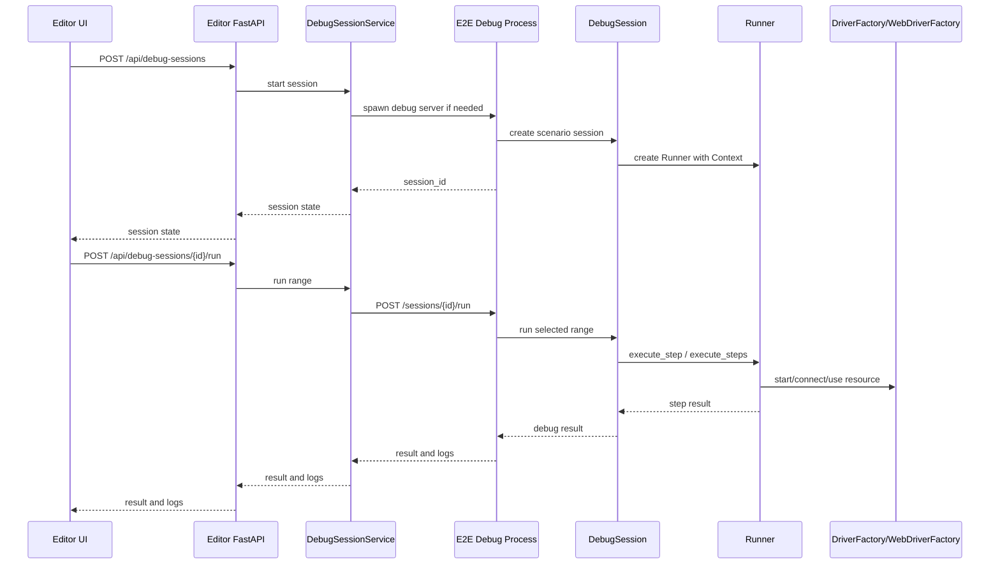

# テストシナリオ実行機能 実装計画 v2

## 1. 目的

E2E Test Scenario Editor から E2EFramework のシナリオを実行し、編集中の JSON シナリオをその場で検証できるようにする。

v1 では、エディタから `pytest tests/test_runner.py` を別プロセスで起動する通常実行を中心に設計した。
しかし、エディタで必要な主な操作は「ここまで実行して前提状態を作る」「その状態のまま選択ステップだけ確認する」「1 ステップずつ進める」というシナリオ開発向けのデバッグである。

pytest 別プロセス実行では、実行が終わるたびに `DriverFactory._app`、`WebDriverFactory._driver`、`Context`、画面状態が失われる。
そのため、`ここまで` の後に `選択のみ` を実行しても、前回起動したアプリやブラウザを利用できない。

v2 では、エディタ側の実行機能をデバッグセッションのみに絞る。
正式な pytest 実行、pytest-html レポート生成、CI に近い回帰確認は、エディタ外の CLI / CI の責務として残す。

主な狙いは以下。

- `ここまで` で前提状態を作り、その状態を保ったまま `選択のみ` や `次へ` を実行できるようにする
- エディタの実行 UX を「状態保持デバッグ」に一本化し、通常実行との混乱をなくす
- 実行ログ、現在位置、ステップ履歴、失敗情報、リソース状態をエディタ上で確認できるようにする
- デバッグ終了時に teardown とリソース close を制御できるようにする

## 2. 方針

### 2.1 エディタはデバッグセッションのみを扱う

エディタの実行ボタン、実行 API、実行パネルはすべてデバッグセッションを操作する。

- `Run all`: デバッグセッション内で先頭から最後まで実行
- `ここまで`: デバッグセッション内で選択ステップまで実行
- `選択のみ`: デバッグセッション内で選択ステップだけ実行
- `次へ`: デバッグセッション内で次の 1 ステップを実行
- `終了`: teardown と resource close を実行してセッション終了
- `強制終了`: debug server プロセスを停止

エディタ側に pytest 通常実行 API は作らない。
これにより、ユーザーが「状態を保持する実行」と「状態を保持しない実行」を意識して使い分ける必要をなくす。

### 2.2 pytest 通常実行は CLI / CI の責務として残す

E2EFramework の既存 pytest 実行は維持する。
必要であれば、将来 E2EFramework 側に `--scenario-file` や `--scenario-id` などの CLI オプションを追加してもよい。
ただし v2 のエディタ MVP には含めない。

pytest 通常実行の用途:

- 正式な通し実行
- pytest-html レポート生成
- CI や回帰確認
- クリーンなプロセスでの最終確認
- 既存 pytest hook / fixture / 通知 / meta.json 生成の利用

### 2.3 常駐デバッグプロセスを使う

エディタの FastAPI プロセス内で E2EFramework を直接 import して動かすのではなく、E2EFramework ルートを `cwd` とする専用 Python プロセスを起動する。
このプロセスを debug server と呼ぶ。

debug server は `127.0.0.1` に bind し、Editor から HTTP で操作する。

理由:

- pywinauto / Selenium などの実行資源を Editor プロセスから分離できる
- 強制終了をプロセス単位で扱える
- E2EFramework の import path、config、成果物パスをフレームワーク側に閉じ込められる
- 将来、エディタ以外のクライアントからも利用しやすい

### 2.4 Phase 1 は単一セッションに制限する

`DriverFactory` と `WebDriverFactory` は現状クラス変数で単一状態を持つ。
そのため Phase 1 では同時デバッグセッション数を 1 件に制限する。

複数セッションや複数アプリ対応は、DriverFactory / WebDriverFactory の alias 化、またはセッション別プロセス分離が必要になるため後続対応とする。

## 3. 前提調査

### 3.1 エディタ側の現状

- バックエンドは FastAPI で、API は `src/backend/api.py` に集約されている。
- 設定は `config.json` を `src/backend/config.py` の `AppConfig` で読み書きしている。
- フロントエンドは Vanilla JS 構成で、`src/static/js/app.js` が各 UI コンポーネントを束ねている。
- タブ状態は `TabManager` が保持し、編集中データはタブごとの `tab.data` に入る。
- ステップ選択、複数選択、グループ表示は `ScenarioEditor` と `GroupManager` が担っている。
- `ignore` によるステップ無効化、`_stepId` によるエディタ内部 ID、`_editor` による UI メタ情報が存在する。

### 3.2 E2EFramework 側の現状

- フレームワークは `D:/Script/E2EFramework` に配置される想定。
- 通常の実行入口は `pytest tests/test_runner.py`。
- `tests/conftest.py` が JSON シナリオを `ScenarioLoader` でロードし、pytest の `scenario` fixture としてパラメータ化している。
- `tests/test_runner.py` は `Runner.execute_scenario(scenario)` を呼ぶ薄い入口である。
- `Runner` は `Context`、`ConditionEvaluator`、`ActionDispatcher` を保持し、ステップを順に実行する。
- `DriverFactory` と `WebDriverFactory` はクラス変数でアプリやブラウザの現在ハンドルを保持している。
- pytest session teardown では `DriverFactory.close_app()` と `WebDriverFactory.close_browser()` が呼ばれる。

### 3.3 現行方式の課題

pytest 別プロセス実行では、1 回の実行が終わると Python プロセス内の状態が消える。
そのため、以下は次回実行へ引き継がれない。

- `DriverFactory._app`
- `WebDriverFactory._driver`
- `Context` の変数
- `Runner` / `ActionDispatcher` のインスタンス
- ページオブジェクトが参照するアプリ接続
- アプリやブラウザの画面状態

この課題を解決するため、エディタ実行は常にデバッグセッション内で行う。

## 4. 実現したい操作

### 4.1 デバッグ開始

アクティブタブのシナリオからデバッグセッションを作成する。

- シナリオファイルを保存してから開始する
- E2EFramework 側の debug server を起動する
- debug server 内に `DebugSession` を作る
- `Context`、`Runner`、完全なシナリオデータを保持する
- 開始直後の現在位置は `steps[-1]` とする

### 4.2 Run all

デバッグセッション内で、シナリオの先頭から最後まで実行する。

- 既にセッションがない場合は自動でデバッグ開始してから実行する
- 実行後もセッションは残す
- 成功後に teardown / close するかは設定または UI 操作で決める
- 初期実装では `steps` 全体を対象にする

### 4.3 ここまで

同じデバッグセッション内で、選択ステップまでを実行する。

- デフォルトでは実行済みステップを再実行しない
- `start_app` や `start_browser` が実行されると、そのハンドルを保持したままセッションが `idle` に戻る
- 再実行したい場合はセッション再作成、または `rerun_executed=true` を使う

### 4.4 選択のみ

同じデバッグセッション内で、選択ステップだけを実行する。

- 現在のアプリ、ブラウザ、Context 状態を使う
- 前提が足りない場合は通常通り失敗する
- 失敗してもセッションは破棄しない
- 失敗後に同じステップを再実行、別ステップを実行、デバッグ終了、強制終了を選べる

### 4.5 次へ

現在位置の次ステップを 1 つ実行する。

- 成功時は現在位置を進める
- 失敗時は現在位置を維持する
- 失敗時もリソースを閉じない

### 4.6 デバッグ終了

デバッグセッションを終了する。

- 必要に応じて `teardown` セクションを実行する
- `DriverFactory.close_app()` と `WebDriverFactory.close_browser()` を呼ぶ
- debug server 内の session を破棄する
- すべての session が閉じた場合は debug server を終了してよい

### 4.7 強制終了

通常の終了ができない場合、debug server プロセスごと停止する。

- 起動した debug server の PID を対象にする
- pywinauto / Selenium の呼び出し中で戻らない場合の最終手段とする
- 残プロセスの検出や警告は後続 Phase で追加する

## 5. 設定

`config.json` に以下を保持する。

```json
{
  "framework_path": "D:/Script/E2EFramework",
  "execution_settings": {
    "python_executable": "",
    "default_env": "DEFAULT",
    "auto_save_before_run": true,
    "max_log_lines": 2000,
    "debug_server_host": "127.0.0.1",
    "debug_server_port": 0,
    "debug_auto_close_resources": true,
    "debug_run_teardown_on_close": true
  }
}
```

- `framework_path`: E2EFramework のルートディレクトリ
- `python_executable`: 空ならフレームワーク内の `.venv`、`venv`、または現在の Python を使う
- `default_env`: debug server の `--env` に渡す値
- `auto_save_before_run`: 実行前にアクティブタブを保存するか
- `max_log_lines`: UI に保持するログ行数
- `debug_server_host`: debug server の bind host。原則 `127.0.0.1`
- `debug_server_port`: `0` の場合は空きポートを自動選択する
- `debug_auto_close_resources`: デバッグ終了時にアプリやブラウザを閉じるか
- `debug_run_teardown_on_close`: デバッグ終了時に teardown を実行するか

設定画面には Framework Path と実行設定を追加する。
高度な debug server 設定は初期実装では UI に出さず、設定ファイルのみでもよい。

## 6. アーキテクチャ



Editor の FastAPI プロセス内で E2EFramework を直接 import しない。
E2EFramework ルートを `cwd` とする debug server プロセスを起動し、Editor から localhost HTTP で呼び出す。

## 7. Editor 側 API

`src/backend/debug_session_service.py` と `src/backend/api.py` に以下を追加する。

| Method | Path | 用途 |
| --- | --- | --- |
| `GET` | `/api/debug-sessions/framework/validate` | Framework Path 検証 |
| `POST` | `/api/debug-sessions` | デバッグセッション作成 |
| `GET` | `/api/debug-sessions/{session_id}` | セッション状態取得 |
| `GET` | `/api/debug-sessions/{session_id}/logs` | セッションログ取得 |
| `POST` | `/api/debug-sessions/{session_id}/run` | 範囲実行 |
| `POST` | `/api/debug-sessions/{session_id}/next` | 次ステップ実行 |
| `POST` | `/api/debug-sessions/{session_id}/cancel` | キャンセル要求 |
| `DELETE` | `/api/debug-sessions/{session_id}` | セッション終了 |
| `POST` | `/api/debug-sessions/{session_id}/force-kill` | デバッグプロセス強制終了 |

開始リクエスト:

```json
{
  "scenario_path": "D:/Script/E2EFramework/scenarios/sample/SAMPLE-001_notepad.json",
  "scenario_id": "SAMPLE-001",
  "env": "DEFAULT"
}
```

ステップ実行リクエスト:

```json
{
  "mode": "single",
  "section": "steps",
  "step_start": 1,
  "step_end": 1,
  "rerun_executed": false
}
```

`mode` は以下。

- `all`: 対象 section の先頭から最後まで実行
- `until`: 対象 section の現在位置または先頭から `step_end` まで実行
- `single`: `step_start` の 1 ステップだけ実行
- `range`: `step_start` から `step_end` まで実行
- `teardown`: teardown セクションを実行

## 8. E2EFramework 側のデバッグセッション拡張

### 8.1 新規モジュール

以下を追加する。

- `src/core/debug/debug_session.py`
- `src/core/debug/debug_server.py`
- `src/core/debug/models.py`
- `src/core/debug/log_buffer.py`
- `scripts/debug_server.py`

`scripts/debug_server.py` は起動入口とする。

```powershell
python scripts/debug_server.py --host 127.0.0.1 --port 0 --env DEFAULT
```

`--port 0` の場合、空きポートを OS に選ばせ、起動後に標準出力へ JSON でポート番号を出す。

### 8.2 Runner の分割

現状の `Runner.execute_scenario()` はシナリオ単位でループする。
デバッグ実行では 1 ステップ単位の結果が必要なため、内部処理を分割する。

```python
class Runner:
    def execute_step(self, step: dict, index: int = None, section: str = "steps") -> dict:
        ...

    def execute_steps(self, scenario: dict, section: str, start: int = None, end: int = None) -> list[dict]:
        ...

    def execute_scenario(self, scenario: dict, section: str = "steps", include_teardown: bool = True):
        ...
```

既存の `execute_scenario()` は後方互換を維持する。
`execute_step()` はデバッグ実行の最小単位として使う。

ステップ結果は少なくとも以下を持つ。

```json
{
  "section": "steps",
  "index": 1,
  "name": "テキストを入力",
  "status": "passed",
  "started_at": "2026-05-18T13:00:00+09:00",
  "ended_at": "2026-05-18T13:00:01+09:00",
  "error": null
}
```

### 8.3 DebugSession

`DebugSession` は pytest から独立して `Runner` を操作する。

```python
class DebugSession:
    def __init__(self, scenario: dict, env: str, run_id: str):
        self.session_id = ...
        self.scenario = scenario
        self.context = initialize_execution_context(env, run_id)
        self.runner = Runner(self.context)
        self.current_section = "steps"
        self.current_index = -1
        self.history = []

    def run_all(self, section: str = "steps") -> dict:
        ...

    def run_until(self, section: str, step_end: int, rerun_executed: bool = False) -> dict:
        ...

    def run_range(self, section: str, step_start: int, step_end: int) -> dict:
        ...

    def run_single(self, section: str, step_index: int) -> dict:
        ...

    def run_next(self) -> dict:
        ...

    def close(self, run_teardown: bool = True, close_resources: bool = True) -> dict:
        ...
```

### 8.4 ScenarioLoader

デバッグセッション開始時は `ScenarioLoader.load_scenarios(file_path=..., scenario_id=...)` を利用する。
ステップ範囲の切り出しは loader では行わず、完全なシナリオを保持した上で `DebugSession` 側が範囲実行する。

理由:

- `ここまで` の後に別のステップを実行するため、完全なステップ配列が必要
- 現在位置や履歴を session 内で管理しやすい
- 共有シナリオ展開後の実行対象とログを一貫させやすい

### 8.5 Context 初期化の共通化

pytest fixture の `setup_session` 相当の処理を、デバッグセッションから呼べる関数に分ける。

```python
def initialize_execution_context(env: str, run_folder: str) -> Context:
    context = Context()
    context.load_config("config/config.ini", env)
    context.set_variable("SCREENSHOTDIR", screenshot_dir)
    return context
```

これにより、config、screenshot dir、run folder の扱いを pytest 実行とデバッグ実行で揃える。

### 8.6 Debug Process API

debug server は `127.0.0.1` のみに bind する。

| Method | Path | 用途 |
| --- | --- | --- |
| `GET` | `/health` | 起動確認 |
| `POST` | `/sessions` | セッション作成 |
| `GET` | `/sessions/{id}` | 状態取得 |
| `GET` | `/sessions/{id}/logs` | ログ取得 |
| `POST` | `/sessions/{id}/run` | 範囲実行 |
| `POST` | `/sessions/{id}/next` | 次ステップ実行 |
| `POST` | `/sessions/{id}/cancel` | キャンセル要求 |
| `DELETE` | `/sessions/{id}` | teardown / close |
| `POST` | `/shutdown` | プロセス終了 |

### 8.7 リソース終了

デバッグセッションでは各ステップ実行後に `DriverFactory.close_app()` や `WebDriverFactory.close_browser()` を呼ばない。
セッション終了時のみ以下を行う。

- `run_teardown=true` の場合は `teardown` セクションを実行する
- `close_resources=true` の場合は app/browser を閉じる
- teardown や close で失敗しても session metadata にエラーを残す

### 8.8 キャンセル

pywinauto や Selenium の呼び出し中に Python 側から安全に即時停止することは難しい。
Phase 1 の通常キャンセルは以下に限定する。

- セッション状態を `cancelling` にする
- 現在の action が戻った後、次ステップへ進まない
- UI には「現在の操作が戻るまで待機」と表示する

即時停止が必要な場合は debug server の強制終了を使う。

## 9. フロントエンド UI

### 9.1 実行ボタン

エディタの実行ボタンはすべてデバッグセッション操作にする。

- `Run all`: デバッグセッション内で全 steps を実行
- `ここまで`: 選択ステップまで実行
- `選択のみ`: 選択ステップだけ実行
- `次へ`: 次の 1 ステップを実行
- `停止`: キャンセル要求
- `終了`: デバッグ終了
- `強制終了`: debug server 強制終了

明示的な `デバッグ開始` ボタンを置くか、最初の実行操作で自動開始するかは UI 実装時に決める。
Phase 1 では明示的な `デバッグ開始` を置く方が状態を理解しやすい。

### 9.2 実行パネル

実行パネルには以下を表示する。

- session id
- status: `not_started` / `starting` / `idle` / `running` / `failed` / `cancelling` / `closing` / `closed` / `killed`
- 現在位置: `steps[1] テキストを入力`
- 実行済みステップ履歴
- 最後のエラー
- debug log
- app/browser の接続状態
- session artifacts

ステップ一覧では、デバッグ中のみ以下を表示する。

- 実行済み成功 / 失敗
- 現在位置
- 次に実行されるステップ

## 10. データモデル

### 10.1 デバッグセッション状態

```json
{
  "session_id": "dbg_20260518_230000_ab12cd34",
  "status": "idle",
  "scenario_path": "D:/Script/E2EFramework/scenarios/sample/SAMPLE-001_notepad.json",
  "scenario_id": "SAMPLE-001",
  "env": "DEFAULT",
  "current_section": "steps",
  "current_index": 1,
  "started_at": "2026-05-18T23:00:00+09:00",
  "ended_at": null,
  "resources": {
    "app_active": true,
    "browser_active": false
  },
  "last_result": {
    "status": "passed",
    "steps": []
  },
  "artifacts": {
    "session": "D:/Script/E2EFramework/reports/debug_dbg_xxx/session.json",
    "log": "D:/Script/E2EFramework/reports/debug_dbg_xxx/debug.log",
    "screenshots": "D:/Script/E2EFramework/reports/debug_dbg_xxx/screenshots"
  }
}
```

### 10.2 ステップ結果

```json
{
  "section": "steps",
  "index": 1,
  "name": "テキストを入力",
  "status": "passed",
  "started_at": "2026-05-18T23:00:10+09:00",
  "ended_at": "2026-05-18T23:00:11+09:00",
  "duration_ms": 1000,
  "error": null
}
```

## 11. ログと成果物

デバッグ実行では pytest-html とは分けて、セッション用成果物を作る。

```text
reports/debug_dbg_20260518_230000_ab12cd34/
  debug.log
  screenshots/
  session.json
```

`session.json` には以下を保存する。

- session id
- scenario path
- scenario id
- env
- started_at / ended_at
- step results
- last error
- resource close policy

将来、デバッグセッション結果から簡易 HTML レポートを作ることは可能だが、pytest-html と同じ意味のテストレポートとは分ける。

## 12. 実行前保存

デバッグセッションはディスク上の JSON をロードする。
未保存のタブをどう扱うかを明確にする。

- 未保存変更あり、かつ `auto_save_before_run=true`: 実行前に保存する
- 保存に失敗した場合は実行しない
- 外部変更競合がある場合は既存保存処理と同じ確認を出す
- 新規未保存ファイルの場合は「名前を付けて保存」が完了するまで実行できない

将来、一時ファイル実行も検討できる。
ただし、フレームワークのシナリオ探索、共有シナリオ展開、成果物パスとの整合を考えると、初期実装では通常保存を優先する。

## 13. 排他制御

Phase 1 では単純化のため、デバッグセッションは同時に 1 件だけ許可する。

- debug server は同時セッション 1 件に制限する
- セッション実行中は別の実行操作を無効化する
- セッションが `idle` の場合は、同じセッション内で次の操作を受け付ける
- 別シナリオを実行する場合は、現在のセッション終了を促す

理由:

- `DriverFactory` / `WebDriverFactory` が単一状態を持つ
- UI 上の現在位置やログ表示を単純にできる
- pywinauto / Selenium のリソース競合を避けられる

## 14. エラーハンドリング

- Framework Path 未設定: 実行ボタン disabled、設定への導線を表示
- Framework Path 不正: API は 400、UI は設定確認メッセージを表示
- debug server 起動失敗: `failed_to_start` として記録し、stderr を表示
- session 作成失敗: scenario path、scenario id、env、loader error を表示
- step 失敗: session は破棄せず `failed` にする
- 通常キャンセル: 現在 action が戻った後に次ステップへ進まない
- 強制終了: debug server プロセスを停止し、session は `killed` とする
- teardown 失敗: close result に記録し、可能なら resources close は続行する
- 未保存ファイル: 保存完了まで実行不可
- 外部変更競合: 既存の保存競合フローを使う

## 15. セキュリティと安全性

このツールはローカル専用だが、実行機能は任意コマンド実行に近いリスクを持つ。
以下を必須にする。

- debug server 起動コマンドは `python scripts/debug_server.py` に固定する
- `cwd` は検証済み `framework_path` に固定する
- `framework_path` は存在するディレクトリで、`tests/test_runner.py` と `pytest.ini` があることを検証する
- scenario path は設定済み `scenario_directories` または `shared_scenario_dir` 配下に限定する
- debug server は `127.0.0.1` のみに bind する
- API リクエストから任意のコマンドライン引数を直接渡せないようにする
- ログ表示は HTML として挿入せず、テキストとして描画する
- 強制終了時は起動した debug server プロセスだけを対象にする

## 16. 実装フェーズ

### Phase 0: 方針確定

- エディタ側の実行はデバッグセッションのみとする
- pytest 通常実行 API は v2 MVP から外す
- デバッグ終了時の teardown 実行有無の初期値を決める
- 同時セッション 1 件制限を明文化する
- `Run all` 後にセッションを残すか、自動終了するかの初期挙動を決める

### Phase 1: デバッグセッション MVP

目的は、メモ帳サンプルで `ここまで` 後に `選択のみ` が成功すること。

対象リポジトリ: `D:/Script/E2EFramework`

- `Runner.execute_step()` / `execute_steps()` を追加
- pytest fixture から独立した Context 初期化関数を追加
- `DebugSession` を追加
- `debug_server.py` を追加
- debug server の `/health`、`/sessions`、`/sessions/{id}/run`、`DELETE /sessions/{id}` を実装
- session close で `DriverFactory.close_app()` / `WebDriverFactory.close_browser()` を呼ぶ

対象リポジトリ: `D:/Script/E2ETestScenarioEditor`

- `framework_path` と debug execution settings を設定に追加
- `DebugSessionService` を追加
- debug server プロセス起動、ポート検出、終了を実装
- debug session API を追加
- フロントエンドに `デバッグ開始` / `ここまで` / `選択のみ` / `終了` を追加

受け入れ条件:

- `デバッグ開始` でセッションが作成される
- 「メモ帳を起動」まで実行後、メモ帳が閉じない
- 「テキストを入力」の `選択のみ` が同じセッション内で成功する
- `デバッグ終了` でメモ帳が閉じる
- 既存の pytest CLI 実行が壊れない

### Phase 2: ステップ実行 UX

- `Run all` を debug session 経由で追加
- `次へ` を追加
- 現在位置と実行済み状態をステップ一覧に表示
- 失敗ステップを UI 上で強調
- debug log のポーリングを実装
- `rerun_executed` の制御を追加
- デバッグ中のスクリーンショット取得補助を追加

### Phase 3: teardown / cleanup 強化

- `run_teardown` の UI オプションを追加
- 失敗時にリソースを残す / 閉じるを選べるようにする
- 強制終了後の残プロセス検出を追加
- app/browser の接続状態ヘルスチェックを追加
- debug session metadata を安定保存する

### Phase 4: 複数アプリ / 複数セッション対応

- `DriverFactory` の alias 化
- `WebDriverFactory` の alias 化
- `BasePage` の app alias 対応
- `SystemAction.connect_app` を追加
- session 別 debug process、または session 別 DriverFactory 状態を導入

### Phase 5: 品質向上

- 実行履歴の保持
- 前回失敗したシナリオの再実行
- ログ内の失敗ステップ名をクリックして該当ステップへジャンプ
- デバッグセッション結果から簡易 HTML レポートを生成する
- 実行結果をステップ単位で保持するため、フレームワーク側のログ形式を JSON Lines 化する

## 17. テスト計画

### 17.1 Editor backend

- 設定ロード/保存で既存 config と互換性がある
- 不正な Framework Path を拒否する
- debug server を起動できる
- 起動失敗時に明確なエラーを返す
- session API が debug server へ正しくプロキシされる
- force kill で対象プロセスだけを終了する
- scenario path の許可範囲外を拒否する

### 17.2 Editor frontend

- 未選択時は `ここまで` / `選択のみ` が disabled
- 単一ステップ選択時に until/single の index が正しく解決される
- グループ内ステップでも index が正しく解決される
- 未保存タブでは保存後に実行される
- 実行中に停止できる
- ログが増えても UI が破綻しない
- 現在位置と実行済み状態が表示される

### 17.3 E2EFramework Runner

- `Runner.execute_step()` が 1 ステップだけ実行する
- `Runner.execute_steps()` が指定範囲だけ実行する
- ignored step が skip される
- condition false の step が skip される
- 例外時に step result が failed になる
- 既存 `execute_scenario()` の挙動が維持される

### 17.4 DebugSession

- セッション開始時に Context と Runner が作られる
- `run_until` 後に現在位置が更新される
- `run_single` が同じ Context / DriverFactory を使う
- 失敗後もセッションが残る
- close 時に teardown と close resources が実行される
- force kill 後に Editor 側状態が破綻しない

### 17.5 結合

- メモ帳サンプルでデバッグの `ここまで` 後に `選択のみ` が成功する
- Web ブラウザ起動シナリオで同じ WebDriver を使って次ステップを実行できる
- `Run all` が debug session 経由で全 steps を実行する
- デバッグ失敗時に画面状態が残る
- デバッグ終了でリソースが閉じる
- 既存の編集、保存、タブ復元に影響しない
- 既存の pytest CLI 実行に影響しない

## 18. リスクと対応

### 18.1 デバッグプロセスの残留

デバッグプロセスや対象アプリが残る可能性がある。
Editor 側に強制終了を用意し、起動した debug server の PID を必ず保持する。

### 18.2 アクションの即時キャンセル困難

pywinauto や Selenium の呼び出し中は Python 側から安全に割り込めない場合がある。
Phase 1 では強制終了を最終手段とし、通常キャンセルは次ステップ抑止として扱う。

### 18.3 pytest レポートとの差異

デバッグ実行は pytest の test result ではない。
UI では「デバッグ結果」として明確に表示し、正式な pytest レポートが必要な場合は CLI / CI で実行する。

### 18.4 DriverFactory の単一状態

現状の `DriverFactory` はクラス変数で単一アプリを持つ。
Phase 1 では同時セッション 1 件に制限し、複数アプリ対応は alias 化の設計に分離する。

### 18.5 共有シナリオ展開後のステップ番号ズレ

`run_scenario` により共有シナリオが展開されると、エディタ上の 1 ステップが実行時には複数ステップになる。
デバッグ実行では完全なシナリオを保持し、必要に応じて展開後ステップと元ステップの対応を履歴に残す。

## 19. 推奨 MVP

最初に作る範囲は以下に絞る。

1. E2EFramework に `Runner.execute_step()` を追加する
2. E2EFramework に単一セッション専用の `DebugSession` を追加する
3. E2EFramework に localhost の debug server を追加する
4. Editor に `DebugSessionService` を追加する
5. UI に `デバッグ開始`、`ここまで`、`選択のみ`、`終了` を追加する
6. メモ帳サンプルで、デバッグの `ここまで` 後に `選択のみ` が成功することを確認する

この範囲で、エディタが必要とする「状態保持されたシナリオ開発用実行」を実現できる。
正式な pytest 通し実行は引き続き CLI / CI で行う。

## 20. 参考

- E2EFramework repository: https://github.com/y24/E2EFramework
- ローカル確認対象: `D:/Script/E2EFramework/tests/conftest.py`
- ローカル確認対象: `D:/Script/E2EFramework/tests/test_runner.py`
- ローカル確認対象: `D:/Script/E2EFramework/src/core/scenario_loader.py`
- ローカル確認対象: `D:/Script/E2EFramework/src/core/execution/runner.py`
- ローカル確認対象: `D:/Script/E2EFramework/src/utils/driver_factory.py`
- ローカル確認対象: `D:/Script/E2EFramework/src/utils/web_driver_factory.py`
- ローカル確認対象: `D:/Script/E2EFramework/docs/knowledge/pytest-command-samples.md`
- ローカル確認対象: `D:/Script/E2EFramework/docs/planning/scenario-execution-control.md`
